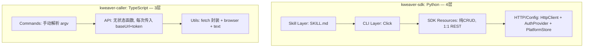
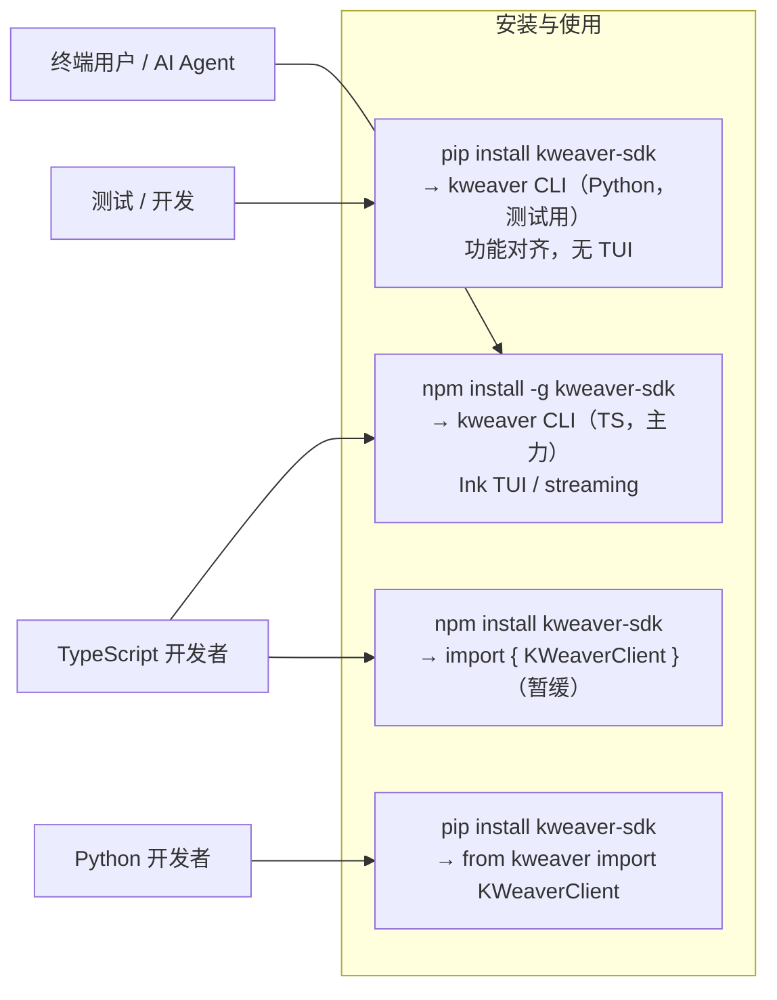

# 合并 KWeaver Python + TypeScript SDK

## 当前设计差异分析

### 架构层次对比




### 关键设计差异汇总

**1. 定位不同**

- `kweaver-sdk`: SDK 库 + CLI 工具（双重身份），Python 包可被 import
- `kweaver-caller`: 纯 CLI 工具，无可 import 的公共库 API

**2. CLI 框架不同**

- Python: Click 框架，统一的装饰器、`@handle_errors`、`pp()` 输出
- TypeScript: 手动 `for` 循环解析 argv，无框架

**3. Auth 提供者数量不同**

- Python: 5 种 AuthProvider（TokenAuth / PasswordAuth / OAuth2Auth / OAuth2BrowserAuth / ConfigAuth）
- TypeScript: 单一 OAuth2 授权码流程 + `ensureValidToken()` 刷新

**4. 编排（Orchestration）层次不同**

- Python CLI 内含多步工作流：`ds connect` = test + create + scan；`kn create` = 多个 SDK 调用链
- TypeScript 命令基本是 1:1 对应 API 调用

**5. 交互式 TUI 仅 TypeScript 有**

- `kweaver-caller` 使用 Ink (React) 实现交互式终端聊天 REPL
- `kweaver-sdk` 全部输出 JSON，无 TUI

**6. API 覆盖范围**


| 功能域                                               | Python      | TypeScript  |
| ------------------------------------------------- | ----------- | ----------- |
| DataSource / DataView / ObjectType / RelationType | ✅           | 暂缓          |
| Query（语义/实例/子图）、ActionType、Agent                  | ✅           | ✅           |
| Context Loader (MCP)                              | 需补充         | ✅ 完整实现      |
| 交互式 TUI 聊天                                        | ❌（框架限制，不实现） | ✅ Ink/React |
| auth delete / token 命令                            | 需补充         | ✅           |
| kn stats / update / action-log cancel             | 需补充         | ✅           |
| agent list 服务端分页                                  | 需补充         | ✅           |
| call -H/--verbose/-bd                             | 需补充         | ✅           |


**7. Config 存储完全兼容**

- 两者均使用 `~/.kweaver/` + base64url 编码目录名，**格式相同**，`kweaver auth login` 登录状态可共享

---

## 架构定位




- **主力 CLI**：TypeScript，`npm install -g kweaver-sdk` → `kweaver`，带 Ink TUI 和流式 agent chat
- **第二 CLI**：Python，`pip install kweaver-sdk` → `kweaver`，用于测试和开发，功能与 TS 对齐（无 TUI）
- **Python SDK 库**：`from kweaver import KWeaverClient`，完整功能（含 context-loader）
- **TypeScript SDK 库层**：暂缓，后续迭代补充
- **唯一不对齐项**：交互式 TUI（Ink/React 是 Node.js 生态，Python 不实现）

## 合并方案：统一 Monorepo

### 目标目录结构

```
kweaver-sdk/                          ← 保留 repo 名（归属 kweaver-ai org）
├── packages/
│   ├── python/                       ← 当前 kweaver-sdk 整体移入，CLI 保留并补齐
│   │   ├── src/
│   │   │   └── kweaver/              ← Python 包（import kweaver）
│   │   │       ├── __init__.py
│   │   │       ├── _auth.py
│   │   │       ├── _client.py
│   │   │       ├── _crypto.py
│   │   │       ├── _errors.py
│   │   │       ├── _http.py
│   │   │       ├── types.py
│   │   │       ├── config/
│   │   │       ├── resources/        ← datasources, kn, agents, query, context_loader...
│   │   │       └── cli/              ← kweaver CLI（Click），保留并补齐所有命令
│   │   ├── tests/
│   │   ├── pyproject.toml            ← 移除 [project.scripts] kweaver 条目
│   │   └── uv.lock
│   │
│   └── typescript/                   ← 当前 kweaver-caller 整体移入
│       ├── src/
│       │   ├── cli.ts                ← 入口
│       │   ├── auth/
│       │   ├── api/                  ← kn, agent-chat, agent-list, context-loader, ontology-query
│       │   ├── commands/
│       │   ├── config/
│       │   ├── ui/                   ← Ink TUI（交互式 agent chat）
│       │   └── utils/
│       ├── bin/
│       │   └── kweaver.js            ← 从 kweaverc.js 重命名
│       ├── test/
│       ├── ref/                      ← API 参考文档（内部）
│       ├── tsconfig.json
│       └── package.json              ← name: kweaver-sdk，bin: { kweaver: ... }
│
├── skills/
│   └── kweaver-core/                 ← 合并两个 SKILL.md，聚焦 TS CLI
│       ├── SKILL.md
│       ├── agent.md
│       ├── action.md
│       ├── kn.md
│       └── examples.md
│
├── .claude/
│   └── skills/
│       └── kweaver/
│           └── SKILL.md              ← Claude Code 自动加载入口
│
├── docs/
│   ├── kweaver_sdk_design.md         ← Python SDK 设计文档（保留）
│   ├── integration_kweaver_caller.md ← 归档
│   └── superpowers/
│
└── README.md                         ← 一个 CLI（TS）+ 两个 SDK 库
```

### 文件移动映射

**Python（整体移入 `packages/python/`，内部结构不变）：**

- `src/` → `packages/python/src/`
- `tests/` → `packages/python/tests/`
- `pyproject.toml` → `packages/python/pyproject.toml`（**保留** `[project.scripts]` 和 `cli` dep，Python CLI 继续作为 entry point）
- `uv.lock` → `packages/python/uv.lock`
- `docs/` → 保留在根 `docs/`
- `skills/` → 合并到根 `skills/`

**TypeScript（整体移入 `packages/typescript/`，内部结构不变）：**

- `src/` → `packages/typescript/src/`
- `bin/kweaverc.js` → `packages/typescript/bin/kweaver.js`（重命名）
- `test/` → `packages/typescript/test/`
- `ref/` → `packages/typescript/ref/`
- `tsconfig.json` → `packages/typescript/tsconfig.json`
- `package.json` → `packages/typescript/package.json`（改 name + bin）
- `AGENTS.md` → `packages/typescript/AGENTS.md`
- `skills/kweaver-core/` → 合并到根 `skills/kweaver-core/`

### Python CLI 保留说明

Python CLI（`kweaver` 命令，Click 实现）保留作为第二入口，用途：

- 开发和测试时快速验证 SDK 功能
- 为没有 Node.js 环境的用户提供备选

`pyproject.toml` 保持不变，`[project.scripts]` 和 `cli` dep 继续存在。

### TypeScript CLI 命名改动

`packages/typescript/package.json`：

```json
{
  "name": "kweaver-sdk",
  "bin": { "kweaver": "bin/kweaver.js" }
}
```

### Skill 统一策略

`skills/kweaver-core/SKILL.md` 为唯一权威版本：

- 主体内容以 **TS CLI 的 `kweaver` 命令**为主（更好的 UX，含 TUI）
- 新增"Python CLI"章节：说明 Python `kweaver` 命令的安装和用法（功能相同，无 TUI）
- 新增"Python SDK 程序化调用"章节：说明 `from kweaver import KWeaverClient` 用法
- 两套 CLI 命令结构完全一致（同名命令、同样的 flag）

---

## CLI 命令对齐详细清单

以下是已实现的 TypeScript 命令与 Python 不一致处，需修改：

### 1. 命令组名 `bkn` → `kn`

TypeScript 使用 `bkn`，Python 使用 `kn`。作为唯一 CLI 统一为 `kn`。

涉及文件：

- `/Users/cx/Work/kweaver-caller/src/commands/bkn.ts` — 所有 `bkn` 改为 `kn`
- `/Users/cx/Work/kweaver-caller/src/cli.ts` — 路由 `bkn` 改为 `kn`

### 2. Auth Login 命名：`auth <url>` → `auth login <url>`


| 当前 TS                | 目标                         | Python                     |
| -------------------- | -------------------------- | -------------------------- |
| `kweaver auth <url>` | `kweaver auth login <url>` | `kweaver auth login <url>` |


涉及文件：`src/commands/auth.ts` 中 `parseAuthArgs()` 识别 `login` 子命令。

### 3. Agent 会话管理：补充缺失命令

Python 有，TypeScript 没有，需补充：

- `kweaver agent sessions <agent_id>` — 列出 Agent 的历史会话
- `kweaver agent history <conv_id>` — 查看某会话的消息历史

涉及文件：`src/commands/agent.ts`、`src/api/`（需确认对应 REST 端点）。

### 4. `kn delete` 确认提示

Python `kn delete` 要求输入确认（`--yes` flag 跳过）。TypeScript 直接删除。

对齐方案：TypeScript `kn delete` 增加 `--yes/-y` flag，默认要求 stdin 确认。

涉及文件：`src/commands/bkn.ts`（delete 分支）。

### 5. 默认输出格式：始终 pretty-print


|      | Python                    | TypeScript            |
| ---- | ------------------------- | --------------------- |
| 默认输出 | 始终 `json.dumps(indent=2)` | 紧凑 JSON，需加 `--pretty` |


统一为默认 pretty-print（JSON indent=2），`--pretty` flag 可保留但默认为 `true`，或移除改为始终格式化。

涉及文件：所有 commands 文件的输出逻辑。

### 6. Action Execute 等待行为

Python `action execute` 有 `--wait/--no-wait --timeout`（默认 wait），会轮询直到执行完毕。TypeScript `kn action-type execute` 是 fire-and-forget。

对齐方案：TypeScript 增加 `--wait/--no-wait --timeout` 参数，轮询 `action-execution get` 直到终态。

涉及文件：`src/commands/bkn.ts`（action-type execute 分支）、`src/api/ontology-query.ts`。

---

### TypeScript 独有特性（保留，不需与 Python 对齐）


| 特性                           | 说明                         |
| ---------------------------- | -------------------------- |
| `auth delete <platform>`     | Python 无此命令，保留             |
| `token` 命令                   | 打印 access token，保留         |
| `agent chat` 交互式 TUI         | Ink/React，Python 无，保留      |
| `agent chat --stream`        | 流式输出，保留                    |
| `agent list` 服务端分页/过滤参数      | 比 Python 功能更强，保留           |
| `kn stats`、`kn update`       | Python 无，保留                |
| `kn list` 排序/分页              | 比 Python 功能更强，保留           |
| `kn action-log cancel`       | Python 无，保留                |
| `kn action-execution get`    | Python 无，保留                |
| `call -H/--header --verbose` | 比 Python 功能更强，保留           |
| `-bd/--biz-domain` 全局 flag   | Python 用环境变量，TS 显式 flag，保留 |
| `context-loader` 整组          | Python 无完整实现，保留            |


---

### 暂缓事项（后续迭代）

TypeScript 缺失的模块（CLI 子命令 + SDK 库层），待后续补充：

- `datasources.ts`、`dataviews.ts`、`objectTypes.ts`、`relationTypes.ts`
- `kn build` 完整编排支持（依赖 datasources）
- TypeScript SDK 库层（`KWeaverClient` 类，可 import）
- `query search` 直接语义搜索命令（目前 TS 只能通过 context-loader 访问）

---

## 实施任务

